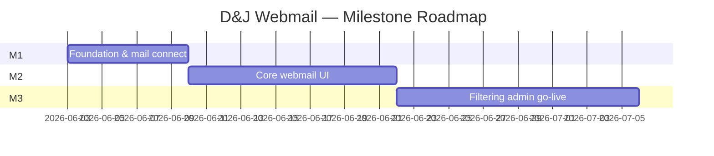

# Overall Roadmap — D&J Group Webmail

**Stack:** PHP + MySQL + WAMP  
**Timeline target:** ~4–6 weeks (simple MVP)  
**Approach:** One master roadmap → plan and build **per milestone** (start at Milestone 1)

---

## 1. Project Goal

Replace **Thunderbird on a VM** with a **PHP webmail application** so the team can:

- Access the shared team mailbox in a browser
- Read, send, reply, and organize mail in shared folders (employees, clients, spam, trash)
- Run **email filtering inside the PHP app** — triggered when **any employee opens the mailbox**
- Add employees, aliases, and client folders **dynamically** through the admin UI (no code changes)
- Migrate to a new server with **only PHP files + SQL backup** (no cron, no extra server setup)

---

## 2. Client Requirements (Confirmed)

| # | Requirement | How we satisfy it |
|---|-------------|-------------------|
| 1 | No cPanel or mail-server filter software — filtering runs **entirely in PHP** | Filter engine in PHP reads MySQL rules, moves mail via IMAP on each session |
| 2 | No cron, task schedulers, Windows services, or background processes | Filtering runs **on mailbox open** (login / dashboard load), not on a schedule |
| 3 | No server-side filter dependencies | Only standard IMAP/SMTP connection to the mailbox; no cPanel filter config |
| 4 | Dynamic config — new employee/account adds folders + rules without code changes | Admin UI writes to MySQL; app creates IMAP folders and rules automatically |
| 5 | When **any** employee opens the mailbox, filtering runs for **all** folders/accounts | Single shared filter pass on session start processes entire mailbox |
| 6 | Reply defaults to the **same alias** the mail was received on | Store `Delivered-To` / `To` on read; pre-fill From on reply |
| 7 | Client folders never opened in UI still receive filtered mail | IMAP MOVE on server during filter pass — UI does not need to open folder |
| 8 | Detect spam and move to Spam folder automatically | Spam rules in MySQL (sender, domain, keywords); applied during filter pass |
| 9 | Manual move between folders (e.g. Ankesh → John) | IMAP MOVE in webmail UI |
| 10 | Trash — delete moves mail to Trash folder | IMAP MOVE to Trash (or delete + Trash folder) |
| 11 | Portable migration — only PHP project + SQL backup | All logic and rules in app + DB; update mail credentials after move |

### Important behavior (client agreed)

> **Filtering runs only when someone opens the mailbox.**

- If **no one** opens the site, mail **stays in Inbox** until the next login.
- When **anyone** logs in, PHP runs a full filter pass for **everyone** and **all folders**.
- This is intentional: no cron, no background jobs, no cPanel filters.

---

## 3. Architecture

```text
┌──────────────────────────────────────────────────────────────────┐
│  Employee opens website → Login (PHP session + MySQL users)      │
└───────────────────────────────┬──────────────────────────────────┘
                                ↓
┌──────────────────────────────────────────────────────────────────┐
│  FILTER PASS (runs automatically on login / dashboard load)      │
│  1. Connect IMAP (shared mailbox)                                │
│  2. Load rules from MySQL (spam → company → employee → client)   │
│  3. Scan Inbox (and optionally other source folders)             │
│  4. IMAP MOVE matching mail to target folders                    │
│  5. Includes folders never opened in UI                          │
└───────────────────────────────┬──────────────────────────────────┘
                                ↓
┌──────────────────────────────────────────────────────────────────┐
│  WEBMAIL UI                                                      │
│  • Folder sidebar (IMAP tree)                                    │
│  • Read / compose / reply (reply defaults to received alias)     │
│  • Send-as selection                                             │
│  • Manual move between folders                                   │
│  • Move to Trash                                                 │
└───────────────────────────────┬──────────────────────────────────┘
                                ↓
┌──────────────────────────────────────────────────────────────────┐
│  MySQL — users, aliases, filter_rules, folders, processed_uids   │
│  IMAP/SMTP — mail stored and moved on mail server                │
└──────────────────────────────────────────────────────────────────┘
```

### What we explicitly do NOT use

- cPanel Email Filters / Sieve / server-side rules
- Cron jobs or Windows Task Scheduler
- Background daemons or Windows services
- Thunderbird VM for filtering (replaced by PHP filter-on-access)

---

## 4. Tech Stack

| Layer | Choice |
|--------|--------|
| Backend | PHP 8.x (plain PHP or minimal structure) |
| Database | MySQL |
| Server | WAMP (Windows + Apache + MySQL + PHP) |
| Mail read | IMAP (SSL, port 993) |
| Mail send | SMTP (SSL, port 465 or 587) |
| Auth | PHP sessions + MySQL `users` table |
| Config | `.env` or `config.php` (credentials — never in git) |

**Mail stays on IMAP server.** MySQL stores users, rules, aliases, folder mappings, and processed-message tracking — not full mailbox archives.

---

## 5. Milestone Overview

| Milestone | Focus | Duration | Cumulative |
|-----------|--------|----------|------------|
| **Milestone 1** | Foundation, login, IMAP/SMTP, DB schema | **5–7 days** | Week 1 |
| **Milestone 2** | Webmail UI, read/send/reply, manual move, trash, reply-as-alias | **10–12 days** | Weeks 2–3 |
| **Milestone 3** | Filter engine (on login), spam, admin UI, dynamic folders, go-live | **10–14 days** | Weeks 4–5 |
| **Optional polish** | Performance, search, UX, full pilot | **3–5 days** | Week 6 |

**Total estimate:** 4–6 weeks depending on IMAP quirks, rule complexity, and pilot feedback.



---

## Milestone 1 — Foundation & Mail Connection

**Duration:** 5–7 days  
**Purpose:** App shell, auth, and proven IMAP/SMTP — nothing else works without this.

### Plan (what to design before coding)

- Folder structure for PHP project (`public/`, `src/`, `config/`, `views/`)
- MySQL schema (initial tables)
- IMAP/SMTP wrapper class API
- Login flow (session, roles)
- How credentials are loaded (`.env`)

### Build tasks

**Project setup**
- [ ] WAMP virtual host or `www` subfolder
- [ ] Git repo, `.gitignore` (exclude `.env`, credentials)
- [ ] Composer optional (e.g. PHPMailer, php-imap library) or native PHP IMAP extension

**MySQL tables (v1)**
- [ ] `users` — id, name, username, password_hash, access_code_hash, role (`admin`/`employee`), active
- [ ] `mail_config` — imap_host, imap_port, smtp_host, smtp_port, mailbox_email (encrypted or env-only)
- [ ] `aliases` — id, email, display_name, linked_user_id, default_folder, active
- [ ] `folders` — id, imap_path, display_name, folder_type (`employee`/`client`/`spam`/`trash`/`inbox`/`other`), active
- [ ] `filter_rules` — id, priority, rule_type, condition_field, condition_operator, condition_value, target_folder_id, active
- [ ] `processed_messages` — imap_uid, folder_path, processed_at (avoid re-processing)

**Auth**
- [ ] Login page (username/password or access code — confirm with client)
- [ ] PHP session, logout, session timeout
- [ ] Role check helper (`isAdmin()`)

**IMAP service**
- [ ] Connect with SSL
- [ ] List all folders
- [ ] Open folder, fetch message headers + body (one test message)
- [ ] Parse `Delivered-To`, `To`, `From`, `Subject` for later filtering

**SMTP service**
- [ ] Send plain-text test email
- [ ] Authenticate with mailbox credentials

**UI shell**
- [ ] Layout: header, empty sidebar, main content area
- [ ] Post-login dashboard placeholder (“Mail connection OK”)

### Deliverable

Working login → dashboard showing IMAP folder list + “test send succeeded” (admin-only test button is fine).

### Exit criteria

- [ ] User can log in and log out
- [ ] IMAP lists real folders from client mailbox
- [ ] SMTP sends one test message
- [ ] Credentials not exposed in HTML/JS
- [ ] MySQL schema created and documented

### Client demo

> “Here is the login page. After login you see your real mail folders from the server.”

---

## Milestone 2 — Core Webmail

**Duration:** 10–12 days  
**Purpose:** Daily mail operations — read, send, reply, manual organize. No filter engine yet (or stub only).

### Plan (what to design before coding)

- Screen flow: folder → list → read → compose/reply
- How send-as and reply-as-alias are stored and selected
- IMAP UID + folder path in URLs (for message links)
- Pagination strategy (50 messages per page)
- Trash folder name (confirm: `Trash` or `[Gmail]/Trash` or client custom)

### Build tasks

**Folder sidebar**
- [ ] Load IMAP folder tree
- [ ] Highlight active folder
- [ ] Unread count per folder (optional v1 — nice to have)

**Message list**
- [ ] List messages in selected folder (subject, from, date, unread flag)
- [ ] Pagination
- [ ] Click row → open message

**Read view**
- [ ] Show headers (From, To, Subject, Date)
- [ ] Render HTML body safely (strip scripts; basic sanitization)
- [ ] Plain-text fallback
- [ ] Download attachments (basic)
- [ ] Store **received alias** (`Delivered-To` / `To`) in session or pass to reply form

**Compose / reply / forward**
- [ ] New email form (To, Subject, Body)
- [ ] **Send-as dropdown** — identities from `aliases` / user mapping
- [ ] **Reply: default From = alias mail was received on** (requirement #6)
- [ ] Reply-To / From headers set correctly on SMTP send
- [ ] Forward

**Manual move (requirement #9)**
- [ ] “Move to folder” dropdown on read view and/or list multi-select
- [ ] IMAP MOVE (or COPY + DELETE) to target folder
- [ ] Success/error feedback

**Trash (requirement #10)**
- [ ] Delete button → move to Trash folder (create Trash on IMAP if missing)
- [ ] Trash folder visible in sidebar

**UX basics**
- [ ] Flash messages (success/error)
- [ ] Loading state while IMAP calls run
- [ ] Desktop-friendly layout

### Deliverable

Employee can log in, browse folders, read mail, reply (with correct alias), send new mail, manually move mail, and trash mail.

### Exit criteria

- [ ] Read mail in any folder
- [ ] Compose and send with chosen send-as identity
- [ ] Reply defaults to alias the message was received on
- [ ] Manual move between folders works (e.g. Ankesh → John)
- [ ] Trash moves mail to Trash folder
- [ ] No filter pass required yet for this milestone demo

### Client demo

> “Open Ankesh folder, read an email, reply — notice the From address matches the alias it was sent to. Move an email to John’s folder. Delete an email — it goes to Trash.”

---

## Milestone 3 — Filter Engine, Admin & Go-Live

**Duration:** 10–14 days  
**Purpose:** PHP filtering on login, spam handling, dynamic admin, portability, pilot.

### Plan (what to design before coding)

- Filter pass trigger: `onLogin()` before rendering inbox
- Rule evaluation order: **Spam → Company → Employee → Client**
- Rule types: `to_alias`, `from_domain`, `from_email`, `subject_contains`, `body_contains`, `spam_keyword`, `spam_sender`
- Performance: process Inbox only vs batch limit (e.g. 200 messages per login)
- Admin CRUD flows for users, aliases, folders, rules
- Auto-create IMAP folder when admin adds employee/client

### Build tasks

**Filter engine (core — requirements #1, #2, #5, #7, #8)**
- [ ] `FilterService::run()` called on every login (and optionally on manual “Sync now” button)
- [ ] Connect IMAP, open Inbox
- [ ] Fetch unprocessed messages (track UID in `processed_messages`)
- [ ] Evaluate rules by priority from MySQL
- [ ] **Spam rules first** → move to Spam folder
- [ ] **Employee rules** (e.g. `To: ankesh@…`) → move to employee folder
- [ ] **Client rules** (from domain, subject, etc.) → move to client folder
- [ ] IMAP MOVE to target — works even if folder never opened in UI
- [ ] Log filter actions (optional: `audit_log` table)
- [ ] Show brief “Organizing mail…” on login if pass takes >2 seconds

**Dynamic folders & rules (requirement #4)**
- [ ] Admin adds employee → create MySQL user + alias + default filter rule + **create IMAP folder** if not exists
- [ ] Admin adds client folder name → create `folders` row + IMAP folder + optional routing rule
- [ ] Admin adds/edits/disables filter rules — no PHP code changes
- [ ] Deactivate employee → disable rules, don’t delete folder

**Admin panel**
- [ ] Dashboard: user count, rule count, last filter run time
- [ ] **Users:** add / edit / disable employees
- [ ] **Aliases:** map alias email → user → default folder
- [ ] **Folders:** list, add client folder, set folder type
- [ ] **Filter rules:** CRUD with priority ordering (drag or numeric priority)
- [ ] **Spam rules:** blocked senders, domains, keywords

**Reply-as-alias integration**
- [ ] Verify filter + reply flow end-to-end: mail to alias → filtered to folder → reply uses alias

**Portability (requirement #11)**
- [ ] Document migration: copy PHP files + import SQL dump + update mail credentials in config
- [ ] No cron/server setup steps in migration doc
- [ ] `README.md` with WAMP setup steps

**Security & ops**
- [ ] HTTPS recommended for production
- [ ] Session timeout
- [ ] Error logging to file (not displayed to users)
- [ ] Password hashing (`password_hash()`)

**Go-live**
- [ ] Import client’s real folder names and top rules from Thunderbird VM
- [ ] Pilot with 1–2 users for 2–3 days
- [ ] Fix issues (wrong folder, slow login, alias reply)
- [ ] Short user guide (1 page)

### Deliverable

Full system: open mailbox → auto-filter → read/send/reply/move/trash. Admin manages everything without code changes. Migration doc included.

### Exit criteria

- [ ] Opening mailbox runs filter pass for all rules and all target folders
- [ ] Spam mail moved to Spam folder automatically
- [ ] Mail routed to employee and client folders without opening those folders in UI
- [ ] Admin can add employee + alias + folder + rules via UI
- [ ] Reply uses received alias by default
- [ ] Manual move and Trash still work
- [ ] Migration doc: PHP + SQL only
- [ ] 1–2 pilot users complete real work without Thunderbird for one day

### Client demo

> “Watch: I log in — the app organizes Inbox into employee and client folders automatically. Spam goes to Spam. I add a new client folder in Admin — no code deploy. Reply to an alias email — From is that alias. To migrate servers, we only copy files and database.”

---

## 6. Optional Phase — Polish (Week 6)

Only if time remains or as Phase 2 contract:

| Item | Effort |
|------|--------|
| Search (subject/from) | 2–3 days |
| Unread badges on folders | 1 day |
| “Sync now” button (re-run filter without re-login) | 1 day |
| Filter pass performance (batch / async feel) | 2–3 days |
| Attachment preview | 1–2 days |
| Mobile-friendly sidebar | 2 days |

---

## 7. MySQL Data Model (Full)

```sql
-- Users & auth
users (
  id, name, username, password_hash, access_code_hash,
  role ENUM('admin','employee'), active, created_at, updated_at
)

-- Email aliases (send-as + filter targets)
aliases (
  id, email, display_name, user_id NULL,
  default_folder_id NULL, active, created_at
)

-- Folder registry (maps to IMAP paths)
folders (
  id, imap_path, display_name,
  folder_type ENUM('inbox','employee','client','spam','trash','sent','other'),
  linked_user_id NULL, active, created_at
)

-- Filter rules (evaluated in priority order, lower number = first)
filter_rules (
  id, name, priority, active,
  rule_type ENUM('spam','employee','client','company'),
  condition_field ENUM('to','from','subject','body','from_domain'),
  condition_operator ENUM('equals','contains','ends_with','starts_with'),
  condition_value, target_folder_id, created_at, updated_at
)

-- Track processed Inbox messages (avoid re-filtering)
processed_messages (
  id, imap_uid, folder_path, message_id NULL, processed_at
)

-- Optional audit trail
audit_log (
  id, user_id, action, details, created_at
)
```

---

## 8. Filter Rule Examples

| Priority | Type | Condition | Target folder |
|----------|------|-----------|---------------|
| 10 | spam | from contains `noreply@spam.com` | Spam |
| 20 | spam | subject contains `viagra` | Spam |
| 30 | employee | to equals `ankesh@djgroupllc.info` | 7-Ankesh |
| 40 | employee | to equals `johnt@djgroupllc.com` | 1-John |
| 50 | client | subject contains `K Nails` | Client/K Nails |
| 60 | client | from_domain equals `clientabc.com` | Client/Client ABC |

Rules are stored in MySQL and editable in Admin — not hardcoded in PHP.

---

## 9. Scope: In vs Out

### In scope (MVP)

- PHP + MySQL + WAMP only
- Filter on mailbox open (any employee triggers full pass)
- Spam, employee, client routing via MySQL rules
- Dynamic admin: users, aliases, folders, rules
- Read, send, reply, reply-as-alias, send-as, manual move, trash
- Portable: PHP files + SQL backup
- Single shared mailbox (IMAP/SMTP)

### Out of scope (v1)

- 24/7 filtering when nobody has site open
- cPanel / server-side filters
- Cron, Windows services, background workers
- Calendar, contacts, tasks
- Multiple unrelated Gmail accounts in one UI
- Native mobile app
- AI/ML spam detection
- Full Apple Mail / Thunderbird feature parity

---

## 10. Risks & Mitigations

| Risk | Mitigation |
|------|------------|
| Slow login if Inbox has thousands of unprocessed messages | Batch limit per login; show progress; optional “Sync now” later |
| Mail unfiltered overnight if no one logs in | Set client expectation; first login each morning runs filter |
| IMAP MOVE not supported by host | Fallback COPY + DELETE; test in Milestone 1 |
| Alias not in headers | Check `Delivered-To`, `X-Original-To`, `To`; log missing cases |
| Spam accuracy without server filter | Start with manual spam rules; refine with client feedback |
| Scope creep | Stick to milestone exit criteria; polish goes to Phase 2 |

---

## 11. Success Definition

Project is successful when:

1. **Any employee** opening the site triggers filtering for **all** folders.
2. Spam, employee, and client mail route correctly without opening target folders in UI.
3. **Reply** defaults to the **alias** the mail was received on.
4. **Manual move** and **Trash** work.
5. **Admin** adds employee/client/rules without developer involvement.
6. **Migration** requires only PHP files + SQL + new mail credentials.
7. **No** cron, cPanel filters, or VM/Thunderbird needed for daily work.

---

## 12. Pre–Milestone 1 Checklist (Client Inputs)

Gather before or during Milestone 1 (does not block local setup):

- [ ] IMAP host, port, SSL — e.g. `mail.example.com:993`
- [ ] SMTP host, port, SSL — e.g. `mail.example.com:465`
- [ ] Mailbox email + password (store in `.env` only)
- [ ] List of employees, aliases, and folder names
- [ ] Top Thunderbird filter rules (screenshots or export)
- [ ] Confirm Trash folder name
- [ ] Confirm login style (username/password vs access code)
- [ ] WAMP host machine and URL for deployment

---

## 13. How to Use This Roadmap

1. Read **Milestone 1** section → write your detailed week plan (tasks per day).
2. Build Milestone 1 → demo → client sign-off.
3. Repeat for Milestone 2, then Milestone 3.
4. Do **not** skip exit criteria before moving on.

**Weekly rhythm:** Plan milestone → build → demo → sign-off → next milestone.

---

## 14. One-Page Summary for the Client

> We are building a PHP + MySQL webmail app on WAMP. When anyone opens the mailbox, the app automatically sorts email for everyone — spam to Spam, employee aliases to employee folders, client mail to client folders — including folders you never open. You can move mail manually and use Trash. Replies automatically use the alias the email was received on. Admin can add employees, folders, and rules without code changes. Moving servers only requires copying the PHP project and database. No cPanel filters, cron jobs, or background services are needed.
