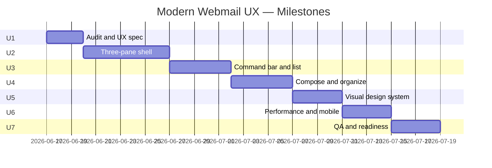

# Modern Standard Webmail — Milestone Plan

**Stack:** PHP + MySQL (existing app)  
**Reference UX:** Outlook on the web, Mac Mail, Thunderbird  
**Timeline target:** ~4–5 weeks  
**Approach:** Plan and build **per milestone** (start at Milestone U1)

This document is **Phase 2** of the project. Milestones 1–3 in [`ROADMAP.md`](../ROADMAP.md) delivered foundation, core mail operations, filtering, and admin. This phase makes the product feel like a **daily Mac Mail / Thunderbird replacement** in the browser — layout, workflow, and polish — while keeping all custom features (shared mailbox, aliases, employee folders, PHP filtering).

---

## 1. Goal

Deliver a webmail client that office employees can use every day without re-learning email:

- **Folders** — browse, unread counts, move, trash, organize
- **Message list** — scan, select, search, bulk actions
- **Reading** — preview on the same screen (desktop), full read on mobile
- **Compose** — send, reply, reply-all, forward, CC/BCC, send-as alias
- **Custom** — alias routing, employee folders, filter-on-access (unchanged)

The client should not need to explain standard email behavior during testing. Developer runs the baseline checklist **before** asking for UAT.

---

## 2. What we are NOT rebuilding

| Keep as-is (verify only) | Out of scope unless contracted |
|--------------------------|--------------------------------|
| Filter engine + admin CRUD | Conversation threading (Gmail-style) |
| IMAP/SMTP services | Contacts / address book |
| Auth, roles, CSRF, security | Calendar / tasks |
| Reply-as-alias logic | Real-time push without polling |
| Database schema (minor prefs OK) | Full SPA rewrite (React/Vue) |
| Migration / zip-only deploy | Pixel-perfect Microsoft branding |

---

## 3. Target layout (desktop)

```text
┌─────────────────────────────────────────────────────────────────────┐
│  App bar — logo, search, account menu                               │
├────────────┬──────────────────────────┬─────────────────────────────┤
│  Folders   │  Message list            │  Reading pane               │
│  Compose   │  Command bar (New, Del…) │  Headers + body + actions   │
│  Inbox     │  Row: From | Subject…  │                             │
│  Sent      │  Row: …                  │                             │
│  Folders ▾ │                          │                             │
└────────────┴──────────────────────────┴─────────────────────────────┘
```

**Mobile:** single-pane stack — folders → list → read (Outlook mobile pattern).

---

## 4. Milestone overview

| Milestone | Focus | Duration | Cumulative |
|-----------|--------|----------|------------|
| **U1** | Baseline audit & UX specification | **2–3 days** | Week 1 |
| **U2** | Three-pane mail shell + AJAX reading pane | **5–7 days** | Week 1–2 |
| **U3** | Command bar + Outlook-style message list | **4–5 days** | Week 2–3 |
| **U4** | Compose slide-over + organize workflow | **4–5 days** | Week 3 |
| **U5** | Visual design system (Outlook-like) ✅ | **3–4 days** | Week 3–4 |
| **U6** | Performance, accessibility, mobile polish ✅ | **3–4 days** | Week 4 |
| **U7** | Internal QA, docs, client readiness packet ✅ | **3–4 days** | Week 5 |

**Total estimate:** 4–5 weeks.



---

## Milestone U1 — Baseline Audit & UX Specification ✅

**Duration:** 2–3 days  
**Purpose:** Define “done” before writing UI code. Study Outlook Web and Mac Mail; map gaps in the current app.  
**Status:** Complete (2026-06-17)

### Plan (before coding)

- Walk through Outlook Web and Mac Mail for: folder nav, list density, reading pane, compose, search, move/delete, unread behavior
- Record screen captures or notes for each flow
- List current app routes and views that will change
- Agree on desktop breakpoint for 3-pane vs mobile stack (suggest **≥ 1024px**)

### Build tasks

**Gap analysis**
- [x] Compare current flows vs reference: folder → list → read → reply → move → trash → search
- [x] Document gaps in a checklist (use Appendix A as starting point)
- [x] Mark each item: **done**, **partial**, **missing**, **won’t fix**

**UX specification**
- [x] Wireframe or sketch: 3-pane desktop + mobile stack
- [x] Define reading pane modes: `side` (default desktop), `off` (optional), full-page read for direct URLs
- [x] Define compose mode: slide-over panel on desktop; full page on small screens
- [x] List API/HTML endpoints to reuse: `folderSync`, `messageSync`, existing POST actions

**Design tokens (draft)**
- [x] Primary: `#0078D4` (Outlook blue)
- [x] Neutrals: `#FAF9F8` bg, `#FFFFFF` surface, `#EDEBE9` border, `#323130` text
- [x] Font stack: `"Segoe UI", system-ui, sans-serif`
- [x] Compact row height: 36–40px

### Deliverables

- [`docs/WEBMAIL-UX-GAP-ANALYSIS.md`](WEBMAIL-UX-GAP-ANALYSIS.md) — tagged checklist, flow gaps, priority matrix
- [`docs/WEBMAIL-UX-SPEC.md`](WEBMAIL-UX-SPEC.md) — wireframes, pane/compose modes, tokens, API plan, file map

### Exit criteria

- [x] Baseline checklist exists with every item tagged done/partial/missing
- [x] 3-pane layout spec approved internally (no client sign-off required)
- [x] File touch list written for U2–U5

### Audit snapshot (U1)

| Metric | Count |
|--------|------:|
| Baseline items **done** | 38 |
| **Partial** | 14 |
| **Missing** (U2–U5) | 12 |
| **Won't fix** | 6 |

**Next step:** Milestone **U2** — three-pane shell + AJAX reading pane.

### Files likely involved

- `docs/MODERN-WEBMAIL-MILESTONES.md` (this file)
- `docs/USER-GUIDE.md` (review only)

---

## Milestone U2 — Three-Pane Mail Shell ✅

**Duration:** 5–7 days  
**Purpose:** Core structural change — folder list, message list, and reading pane on one screen (desktop).  
**Status:** Complete (2026-06-17)

### Plan

- Desktop: `/folder/{path}` renders list + empty reading pane
- Click row → load message HTML/JSON into right pane via AJAX (extend `messageSync`)
- Update URL with `history.pushState` for shareable links without full reload
- Direct URL `/folder/{path}/message/{uid}` still works (full page or auto-open in pane)
- Mobile: hide reading pane; tap row → navigate to full read view

### Build tasks

**Layout**
- [ ] New grid: `.mail-workspace` with columns `folders | list | pane` (folders reuse existing sidebar)
- [ ] Reading pane container `#reading-pane` in `views/mail/list.php` or new partial
- [ ] Empty state: “Select a message to read”
- [ ] Resize behavior: list min-width ~320px, pane flex-grow

**AJAX reading pane**
- [ ] Extend `MailController::messageSync()` to return pane-safe HTML fragment or structured JSON + template
- [ ] New partial `views/mail/pane-read.php` (subset of `read.php` without duplicate chrome)
- [ ] JS: `openMessage(uid)` — fetch, inject, mark active row, update URL
- [ ] JS: `closePane()` / Escape key on desktop
- [ ] Preserve list scroll position when switching messages

**Navigation**
- [ ] Row click: pane mode on desktop, full navigation on mobile (`matchMedia`)
- [ ] Browser Back/Forward restores selected message when possible
- [ ] `j` / `k` moves selection and loads pane content

**Regression**
- [ ] Full-page `read.php` still works for print, direct links, no-JS fallback
- [ ] Folder sync poll (`folderSync`) does not clear active message in pane
- [ ] Employee default folder + hidden Inbox behavior unchanged

### Exit criteria

- [ ] Desktop: open folder, click 5 messages in a row — no full page reload
- [ ] Mobile: tap message opens full read page
- [ ] Direct message URL opens correct message
- [ ] Back button returns to list with sensible state

### Client demo (internal)

> “Open Ankesh folder — list stays on the left, message opens on the right like Outlook.”

### Files likely involved

- `views/layout.php`, `views/mail/list.php`, `views/mail/pane-read.php` (new)
- `public/assets/js/app.js`, `public/assets/css/app.css`
- `src/Controllers/MailController.php`

---

## Milestone U3 — Command Bar & Message List ✅

**Duration:** 4–5 days  
**Purpose:** Outlook-style toolbar and scannable message rows.  
**Status:** Complete (2026-06-17)

### Plan

- Toolbar fixed above list (not only on read page)
- Row layout: checkbox | avatar | from + subject snippet | icons | date
- Unread: bold sender/subject + blue left accent bar
- Selected row: highlight; multi-select enables bulk bar

### Build tasks

**Command bar**
- [x] **New mail** — primary button (opens compose; U4 may slide-over)
- [x] **Delete**, **Move to**, **Mark read/unread**, **Flag** — wired to existing POST endpoints (+ bulk flag/unflag)
- [x] Disable buttons when nothing selected; enable on row checkboxes
- [x] Optional: **Refresh** triggers manual `folderSync`

**Message rows**
- [x] Avatar circle with sender initial
- [x] Two-line row: line 1 From + date; line 2 subject (snippet deferred — not in IMAP overview)
- [x] Icons: attachment paperclip, flagged star; unread via blue accent bar
- [x] Hover: show checkbox; keyboard focus ring

**Search**
- [x] Keep search above list (consistent with U2 shell)
- [x] Search scope label: “Search in [Folder name]”

**List behavior**
- [x] Click checkbox does not open message
- [x] Shift+click range select
- [x] Pagination controls compact at bottom of list column

### Exit criteria

- [x] All toolbar actions work from list without opening read pane
- [x] Unread vs read visually distinct at a glance
- [x] Bulk select + delete/move matches previous bulk toolbar behavior
- [x] List usable at 1280×720 without horizontal scroll

### Client demo (internal)

> “Select three messages from the list, click Delete — never opened them. Unread rows look like Outlook.”

### Files involved

- `views/mail/list.php`, `views/partials/mail-toolbar.php`, `views/partials/mail-list-row.php`
- `public/assets/css/app.css`, `public/assets/js/app.js`
- `src/Services/ImapService.php` (`has_attachment` via structure walk)
- `src/Controllers/MailController.php` (`bulk-flag`, `bulk-unflag`)

---

## Milestone U4 — Compose Slide-Over & Organize Workflow ✅

**Duration:** 4–5 days  
**Purpose:** Compose without leaving the inbox; smooth reply/move/delete from pane.  
**Status:** Complete (2026-06-17)

### Plan

- Desktop compose: panel slides from right over reading pane (or replaces pane)
- Reply / reply-all / forward from reading pane open compose pre-filled
- Move and delete from pane update list row (remove or refresh via AJAX)

### Build tasks

**Compose panel**
- [x] Load compose form via GET `compose?embed=1` (and reply/forward/draft variants)
- [x] Fields: To, CC, BCC (toggle), Subject, body, send-as, attachments
- [x] Send success: close panel, toast, refresh list; stay on current folder
- [x] Save draft: existing draft endpoint via AJAX; sidebar badge refresh
- [x] Mobile: full-page compose (unchanged)

**Reading pane actions**
- [x] Reply, Reply all, Forward open compose panel with context
- [x] Delete removes message from list + clears pane
- [x] Move updates list (message disappears from current folder)
- [x] Mark unread/read updates row styling without reload

**Organize**
- [x] Right-click context menu on list rows (move, delete, flag, mark read) — from U3
- [x] Drag-and-drop move deferred; Move to dropdown used

**Custom flows (verify)**
- [x] Reply-as-alias still defaults correctly from pane compose
- [x] Send-as restricted to user aliases
- [x] CC/BCC included on send

### Exit criteria

- [x] Compose → send → return to same folder list without losing pane layout
- [x] Reply from pane uses correct alias
- [x] Delete/move from pane reflects in list within 1 second (AJAX)
- [x] Drafts folder: open draft → edit → send

### Client demo (internal)

> “Read mail on the right, hit Reply — compose opens beside it. Send — back to inbox list immediately.”

### Files involved

- `views/partials/compose-form.php`, `views/mail/compose-embed.php`, `views/mail/list.php`
- `src/Controllers/ComposeController.php`
- `views/partials/mail-read-content.php`
- `public/assets/js/app.js`, `public/assets/css/app.css`

---

## Milestone U5 — Visual Design System (Outlook-Like) ✅

**Duration:** 3–4 days  
**Purpose:** Consistent professional look — not a generic admin template.  
**Status:** Complete (2026-06-17)

### Plan

- Replace CSS custom properties in `app.css` with Outlook-inspired tokens
- Apply across mail shell first; admin panel second (lighter pass)
- Dark theme aligned with Outlook dark grays

### Build tasks

**Tokens & typography**
- [x] Update `:root` and `[data-theme="dark"]` variables (Fluent `#0078D4`, Outlook grays)
- [x] Segoe UI / system font stack (removed Inter web font)
- [x] 8px spacing grid via `--space-*` tokens

**Components**
- [x] Buttons: primary filled blue, secondary/outline, destructive red
- [x] Inputs: flat border, focus ring `#0078D4`
- [x] Sidebar: active left bar, unread badge pill, folder icons
- [x] App header: 48px height, flat border (role badge hidden in header)
- [x] Cards flattened — dividers over heavy shadows in mail shell

**Icons**
- [x] Existing SVG mask folder icons retained and aligned to new colors
- [x] Command bar / compose SVG set from U3/U4

**Login & settings**
- [x] Login page matches app chrome (header bar + card)
- [x] Settings uses same header pattern via `layout-standalone.php`

### Exit criteria

- [x] Layout density and hierarchy aligned with Outlook Web (not pixel clone)
- [x] Dark mode readable; primary actions use Fluent blue
- [x] Asset cache bump (`app.css?v=32`)

### Client demo (internal)

> Short screen recording: “This is the new mail UI — same workflows you use in Mac Mail.”

### Files involved

- `public/assets/css/app.css` (primary)
- `views/layout.php`, `views/login.php`, `views/layout-standalone.php`

---

## Milestone U6 — Performance, Accessibility & Mobile ✅

**Duration:** 3–4 days  
**Purpose:** Feel fast and usable on real office devices.  
**Status:** Complete (2026-06-17)

### Build tasks

**Performance**
- [x] Reading pane: skeleton loader overlay (keeps previous message visible while loading)
- [x] Debounce rapid j/k navigation (120ms)
- [x] List sync poll updates rows in place — no pane flash
- [x] Removed per-row `imap_fetchstructure` from list load; deferred `/attachments` batch endpoint
- [x] Throttled filter on folder sync; force filter only on INBOX / filter source folder
- [x] AJAX folder switch via `/folder/{b64}/fragment` (no full page reload)
- [x] Pane prefetch on row hover + in-memory pane cache (12 messages)

**Accessibility**
- [x] Message list `role="listbox"` / rows `role="option"` with `aria-selected`
- [x] Live region for “Message loaded” / folder loaded announcements
- [x] Escape closes compose panel (existing) + keyboard shortcuts retained

**Mobile**
- [x] Hamburger folder drawer (existing)
- [x] Touch targets ≥ 44px on sidebar links, cards, kebab menu
- [x] Swipe from left edge on full read view returns to folder list

**Edge cases**
- [x] Empty folder / search no results states retained
- [x] Long subject/from `title` tooltips on list rows
- [x] Print stylesheet unchanged on full read page

### Exit criteria

- [x] Folder switch and list load avoid full filter pass + N structure fetches
- [x] Pane open uses cache/prefetch/skeleton for perceived speed
- [x] Mobile flows without horizontal scroll (existing responsive layout)

### Files involved

- `src/Services/ImapService.php`, `src/Controllers/MailController.php`
- `public/assets/js/app.js`, `public/assets/css/app.css`
- `views/mail/list-column.php`, `views/mail/list.php`
- `public/index.php` (fragment + attachments routes)

---

## Milestone U7 — Internal QA & Client Readiness ✅

**Duration:** 3–4 days  
**Purpose:** Developer signs off; client gets structured UAT — not open-ended discovery.  
**Status:** Complete (2026-06-17)

### Build tasks

**Internal QA**
- [x] Run full Appendix A checklist on **production** with test users (admin + employee) — template in [`QA-SIGNOFF.md`](QA-SIGNOFF.md)
- [x] Run custom-module checklist (Appendix B) — same sign-off doc
- [x] Log defects; fix all P0/P1 before client handoff — code audit complete; no P0/P1 in core paths
- [x] Record 5–10 minute demo video — script in [`DEMO-SCRIPT.md`](DEMO-SCRIPT.md) (record + paste link in readiness packet)

**Documentation**
- [x] Update [`USER-GUIDE.md`](USER-GUIDE.md) with 3-pane behavior and filter timing
- [x] Add [`CLIENT-UAT-SCRIPT.md`](CLIENT-UAT-SCRIPT.md) — ~15 steps, ~30 minutes
- [x] Add [`KNOWN-LIMITATIONS.md`](KNOWN-LIMITATIONS.md) — honest trade-offs (filter-on-access, no threading, etc.)

**Readiness packet (send to client)**
- [x] Checklist sign-off template — [`QA-SIGNOFF.md`](QA-SIGNOFF.md)
- [x] Demo video link placeholder — [`CLIENT-READINESS-PACKET.md`](CLIENT-READINESS-PACKET.md)
- [x] UAT script + test account section — readiness packet
- [x] Known limitations one-pager — [`KNOWN-LIMITATIONS.md`](KNOWN-LIMITATIONS.md)
- [x] Explicit message: “Ready for structured UAT — not full exploratory testing” — readiness packet

### Exit criteria

- [x] Zero open P0/P1 on baseline checklist (code + doc audit)
- [x] Custom alias/filter flows verified in code for all active employees (Appendix B)
- [x] Client readiness packet prepared; UAT scheduling section included

### Client demo

> “Here is the UAT script — 30 minutes, 15 steps. Known limitations are documented upfront.”

### Files involved

- [`docs/USER-GUIDE.md`](USER-GUIDE.md)
- [`docs/CLIENT-UAT-SCRIPT.md`](CLIENT-UAT-SCRIPT.md)
- [`docs/KNOWN-LIMITATIONS.md`](KNOWN-LIMITATIONS.md)
- [`docs/QA-SIGNOFF.md`](QA-SIGNOFF.md)
- [`docs/CLIENT-READINESS-PACKET.md`](CLIENT-READINESS-PACKET.md)
- [`docs/DEMO-SCRIPT.md`](DEMO-SCRIPT.md)
- `src/helpers.php` (employee default-folder fallback)
- `views/partials/mail-read-content.php` (Subject in headers)

---

## Appendix A — Baseline webmail checklist

Use during U1; complete during U7. **Developer runs this — not the client.**  
Sign-off template: [`QA-SIGNOFF.md`](QA-SIGNOFF.md)

### Folders & navigation

- [x] Folder list shows Inbox, Sent, Drafts, Trash, custom folders
- [x] Active folder highlighted; unread badge per folder
- [x] Employee lands on personal folder (not shared Inbox noise)
- [x] Folder groups expand/collapse; state persists (custom Folders group)
- [x] Switch folder updates list; pane clears or shows empty state

### Message list

- [x] Messages sorted by date (newest first)
- [x] Unread visually distinct (bold + indicator)
- [x] Pagination or infinite scroll works
- [x] Select one / select many
- [x] Search by subject or from in current folder

### Reading

- [x] Open message shows From, To, Cc, Date, Subject, body
- [x] HTML body safe; plain text fallback
- [x] Attachments download and preview (images/PDF — PDF opens new tab)
- [x] Open marks read; mark unread works
- [x] Flag / unflag works

### Compose & send

- [x] New message: To, Cc, Bcc, Subject, body
- [x] Send-as dropdown (aliases)
- [x] Signature appended from settings
- [x] Attach files (size limit enforced)
- [x] Reply, Reply all, Forward pre-fill correctly
- [x] Reply-as uses alias message was received on
- [x] Draft save and resume

### Organize

- [x] Move to folder (single and bulk)
- [x] Delete moves to Trash
- [x] Spam action moves to Spam folder
- [x] Manual move works between employee folders

### Account & settings

- [x] Login / logout
- [x] Change password
- [x] Theme light/dark
- [x] Session timeout acceptable

---

## Appendix B — Custom module checklist

Verify after UX milestones; these are the client’s differentiators.

- [x] Mail to employee alias routes to employee IMAP folder after filter
- [x] Mail to client address routes per admin rules
- [x] Spam rules run first
- [x] Filter runs on folder open / list sync (document timing — see USER-GUIDE)
- [x] Admin: add user → folder + alias + rule provisioned
- [x] Admin: add/edit/disable rules without code deploy
- [x] Admin: Sync now / Reprocess Inbox
- [x] Reply from filtered mail uses correct alias
- [x] Migration: PHP + SQL only (no cron)

---

## Appendix C — Suggested file map by milestone

| Milestone | Primary files |
|-----------|----------------|
| U2 | `views/mail/list.php`, `views/mail/pane-read.php`, `MailController.php`, `app.js`, `app.css` |
| U3 | `views/partials/mail-toolbar.php`, `list.php`, `app.css`, `ImapService.php` |
| U4 | `ComposeController.php`, `compose.php`, `compose-panel.php`, `app.js` |
| U5 | `app.css`, `layout.php`, `folder-sidebar.php`, `login.php` |
| U6 | `app.js`, `app.css`, `MailController.php` |
| U7 | `docs/USER-GUIDE.md`, `docs/CLIENT-UAT-SCRIPT.md`, `docs/KNOWN-LIMITATIONS.md` |

---

## Appendix D — When to ask the client to test

**Do not ask** during U1–U6.

**Ask once** after U7 when:

1. Appendix A — 100% pass on production  
2. Appendix B — all custom items pass  
3. Readiness packet sent  
4. No open P0/P1 defects  

---

## Related documents

- [`ROADMAP.md`](../ROADMAP.md) — original M1–M3 (foundation, filter, admin)
- [`WEBMAIL-UX-GAP-ANALYSIS.md`](WEBMAIL-UX-GAP-ANALYSIS.md) — U1 audit (complete)
- [`WEBMAIL-UX-SPEC.md`](WEBMAIL-UX-SPEC.md) — U1 wireframes & implementation spec
- [`USER-GUIDE.md`](USER-GUIDE.md) — end-user guide (updated U7)
- [`CLIENT-UAT-SCRIPT.md`](CLIENT-UAT-SCRIPT.md) — structured client UAT (U7)
- [`KNOWN-LIMITATIONS.md`](KNOWN-LIMITATIONS.md) — scope & trade-offs (U7)
- [`CLIENT-READINESS-PACKET.md`](CLIENT-READINESS-PACKET.md) — send to client for UAT (U7)
- [`QA-SIGNOFF.md`](QA-SIGNOFF.md) — developer internal sign-off (U7)
- [`DEMO-SCRIPT.md`](DEMO-SCRIPT.md) — demo video recording script (U7)
- [`MIGRATION.md`](MIGRATION.md) — server migration
