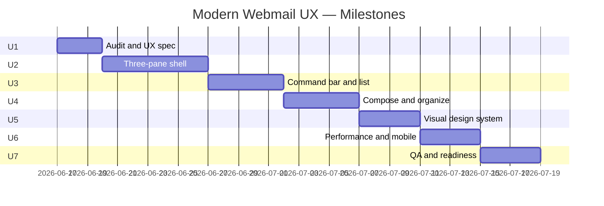

# Modern Standard Webmail — Milestone Plan

**Stack:** PHP + MySQL (existing app)  
**Reference UX:** Outlook on the web, Mac Mail, Thunderbird  
**Timeline target:** ~4–5 weeks  
**Approach:** Plan and build **per milestone** (start at Milestone U1)

This document is **Phase 2** of the project. Milestones 1–3 in [`ROADMAP.md`](../ROADMAP.md) delivered foundation, core mail operations, filtering, and admin. This phase makes the product feel like a **daily Mac Mail / Thunderbird replacement** in the browser — layout, workflow, and polish — while keeping all custom features (shared mailbox, aliases, employee folders, PHP filtering).

---

## 1. Goal

Deliver a webmail client that office employees can use every day without re-learning email:

- **Folders** — browse, unread counts, move, trash, organize
- **Message list** — scan, select, search, bulk actions
- **Reading** — preview on the same screen (desktop), full read on mobile
- **Compose** — send, reply, reply-all, forward, CC/BCC, send-as alias
- **Custom** — alias routing, employee folders, filter-on-access (unchanged)

The client should not need to explain standard email behavior during testing. Developer runs the baseline checklist **before** asking for UAT.

---

## 2. What we are NOT rebuilding

| Keep as-is (verify only) | Out of scope unless contracted |
|--------------------------|--------------------------------|
| Filter engine + admin CRUD | Conversation threading (Gmail-style) |
| IMAP/SMTP services | Contacts / address book |
| Auth, roles, CSRF, security | Calendar / tasks |
| Reply-as-alias logic | Real-time push without polling |
| Database schema (minor prefs OK) | Full SPA rewrite (React/Vue) |
| Migration / zip-only deploy | Pixel-perfect Microsoft branding |

---

## 3. Target layout (desktop)

```text
┌─────────────────────────────────────────────────────────────────────┐
│  App bar — logo, search, account menu                               │
├────────────┬──────────────────────────┬─────────────────────────────┤
│  Folders   │  Message list            │  Reading pane               │
│  Compose   │  Command bar (New, Del…) │  Headers + body + actions   │
│  Inbox     │  Row: From | Subject…  │                             │
│  Sent      │  Row: …                  │                             │
│  Folders ▾ │                          │                             │
└────────────┴──────────────────────────┴─────────────────────────────┘
```

**Mobile:** single-pane stack — folders → list → read (Outlook mobile pattern).

---

## 4. Milestone overview

| Milestone | Focus | Duration | Cumulative |
|-----------|--------|----------|------------|
| **U1** | Baseline audit & UX specification | **2–3 days** | Week 1 |
| **U2** | Three-pane mail shell + AJAX reading pane | **5–7 days** | Week 1–2 |
| **U3** | Command bar + Outlook-style message list | **4–5 days** | Week 2–3 |
| **U4** | Compose slide-over + organize workflow | **4–5 days** | Week 3 |
| **U5** | Visual design system (Outlook-like) | **3–4 days** | Week 3–4 |
| **U6** | Performance, accessibility, mobile polish | **3–4 days** | Week 4 |
| **U7** | Internal QA, docs, client readiness packet | **3–4 days** | Week 5 |

**Total estimate:** 4–5 weeks.



---

## Milestone U1 — Baseline Audit & UX Specification ✅

**Duration:** 2–3 days  
**Purpose:** Define “done” before writing UI code. Study Outlook Web and Mac Mail; map gaps in the current app.  
**Status:** Complete (2026-06-17)

### Plan (before coding)

- Walk through Outlook Web and Mac Mail for: folder nav, list density, reading pane, compose, search, move/delete, unread behavior
- Record screen captures or notes for each flow
- List current app routes and views that will change
- Agree on desktop breakpoint for 3-pane vs mobile stack (suggest **≥ 1024px**)

### Build tasks

**Gap analysis**
- [x] Compare current flows vs reference: folder → list → read → reply → move → trash → search
- [x] Document gaps in a checklist (use Appendix A as starting point)
- [x] Mark each item: **done**, **partial**, **missing**, **won’t fix**

**UX specification**
- [x] Wireframe or sketch: 3-pane desktop + mobile stack
- [x] Define reading pane modes: `side` (default desktop), `off` (optional), full-page read for direct URLs
- [x] Define compose mode: slide-over panel on desktop; full page on small screens
- [x] List API/HTML endpoints to reuse: `folderSync`, `messageSync`, existing POST actions

**Design tokens (draft)**
- [x] Primary: `#0078D4` (Outlook blue)
- [x] Neutrals: `#FAF9F8` bg, `#FFFFFF` surface, `#EDEBE9` border, `#323130` text
- [x] Font stack: `"Segoe UI", system-ui, sans-serif`
- [x] Compact row height: 36–40px

### Deliverables

- [`docs/WEBMAIL-UX-GAP-ANALYSIS.md`](WEBMAIL-UX-GAP-ANALYSIS.md) — tagged checklist, flow gaps, priority matrix
- [`docs/WEBMAIL-UX-SPEC.md`](WEBMAIL-UX-SPEC.md) — wireframes, pane/compose modes, tokens, API plan, file map

### Exit criteria

- [x] Baseline checklist exists with every item tagged done/partial/missing
- [x] 3-pane layout spec approved internally (no client sign-off required)
- [x] File touch list written for U2–U5

### Audit snapshot (U1)

| Metric | Count |
|--------|------:|
| Baseline items **done** | 38 |
| **Partial** | 14 |
| **Missing** (U2–U5) | 12 |
| **Won't fix** | 6 |

**Next step:** Milestone **U2** — three-pane shell + AJAX reading pane.

### Files likely involved

- `docs/MODERN-WEBMAIL-MILESTONES.md` (this file)
- `docs/USER-GUIDE.md` (review only)

---

## Milestone U2 — Three-Pane Mail Shell ✅

**Duration:** 5–7 days  
**Purpose:** Core structural change — folder list, message list, and reading pane on one screen (desktop).  
**Status:** Complete (2026-06-17)

### Plan

- Desktop: `/folder/{path}` renders list + empty reading pane
- Click row → load message HTML/JSON into right pane via AJAX (extend `messageSync`)
- Update URL with `history.pushState` for shareable links without full reload
- Direct URL `/folder/{path}/message/{uid}` still works (full page or auto-open in pane)
- Mobile: hide reading pane; tap row → navigate to full read view

### Build tasks

**Layout**
- [ ] New grid: `.mail-workspace` with columns `folders | list | pane` (folders reuse existing sidebar)
- [ ] Reading pane container `#reading-pane` in `views/mail/list.php` or new partial
- [ ] Empty state: “Select a message to read”
- [ ] Resize behavior: list min-width ~320px, pane flex-grow

**AJAX reading pane**
- [ ] Extend `MailController::messageSync()` to return pane-safe HTML fragment or structured JSON + template
- [ ] New partial `views/mail/pane-read.php` (subset of `read.php` without duplicate chrome)
- [ ] JS: `openMessage(uid)` — fetch, inject, mark active row, update URL
- [ ] JS: `closePane()` / Escape key on desktop
- [ ] Preserve list scroll position when switching messages

**Navigation**
- [ ] Row click: pane mode on desktop, full navigation on mobile (`matchMedia`)
- [ ] Browser Back/Forward restores selected message when possible
- [ ] `j` / `k` moves selection and loads pane content

**Regression**
- [ ] Full-page `read.php` still works for print, direct links, no-JS fallback
- [ ] Folder sync poll (`folderSync`) does not clear active message in pane
- [ ] Employee default folder + hidden Inbox behavior unchanged

### Exit criteria

- [ ] Desktop: open folder, click 5 messages in a row — no full page reload
- [ ] Mobile: tap message opens full read page
- [ ] Direct message URL opens correct message
- [ ] Back button returns to list with sensible state

### Client demo (internal)

> “Open Ankesh folder — list stays on the left, message opens on the right like Outlook.”

### Files likely involved

- `views/layout.php`, `views/mail/list.php`, `views/mail/pane-read.php` (new)
- `public/assets/js/app.js`, `public/assets/css/app.css`
- `src/Controllers/MailController.php`

---

## Milestone U3 — Command Bar & Message List

**Duration:** 4–5 days  
**Purpose:** Outlook-style toolbar and scannable message rows.

### Plan

- Toolbar fixed above list (not only on read page)
- Row layout: checkbox | avatar | from + subject snippet | icons | date
- Unread: bold sender/subject + blue left accent bar
- Selected row: highlight; multi-select enables bulk bar

### Build tasks

**Command bar**
- [ ] **New mail** — primary button (opens compose; U4 may slide-over)
- [ ] **Delete**, **Move to**, **Mark read/unread**, **Flag** — wired to existing POST endpoints
- [ ] Disable buttons when nothing selected; enable on row checkboxes
- [ ] Optional: **Refresh** triggers manual `folderSync`

**Message rows**
- [ ] Avatar circle with sender initial
- [ ] Two-line row: line 1 From + date; line 2 subject + snippet (if available from overview)
- [ ] Icons: attachment paperclip, flagged star, unread dot
- [ ] Hover: show checkbox; keyboard focus ring

**Search**
- [ ] Move search to app bar (Outlook placement) or keep above list — pick one and stay consistent
- [ ] Search scope label: “Search in [Folder name]”

**List behavior**
- [ ] Click checkbox does not open message
- [ ] Shift+click range select (optional v1)
- [ ] Pagination controls compact at bottom of list column

### Exit criteria

- [ ] All toolbar actions work from list without opening read pane
- [ ] Unread vs read visually distinct at a glance
- [ ] Bulk select + delete/move matches current bulk toolbar behavior
- [ ] List usable at 1280×720 without horizontal scroll

### Client demo (internal)

> “Select three messages from the list, click Delete — never opened them. Unread rows look like Outlook.”

### Files likely involved

- `views/mail/list.php`, `views/partials/mail-toolbar.php` (new)
- `public/assets/css/app.css`, `public/assets/js/app.js`
- `src/Services/ImapService.php` (snippet in overview if missing)

---

## Milestone U4 — Compose Slide-Over & Organize Workflow

**Duration:** 4–5 days  
**Purpose:** Compose without leaving the inbox; smooth reply/move/delete from pane.

### Plan

- Desktop compose: panel slides from right over reading pane (or replaces pane)
- Reply / reply-all / forward from reading pane open compose pre-filled
- Move and delete from pane update list row (remove or refresh via AJAX)

### Build tasks

**Compose panel**
- [ ] Load compose form via GET `compose?embed=1` or dedicated partial route
- [ ] Fields: To, CC, BCC (toggle), Subject, body, send-as, attachments
- [ ] Send success: close panel, flash toast, refresh list / open Sent optional
- [ ] Save draft: existing draft endpoint; list refreshes Drafts count
- [ ] Mobile: full-page compose (current behavior OK)

**Reading pane actions**
- [ ] Reply, Reply all, Forward open compose panel with context
- [ ] Delete removes message from list + clears pane
- [ ] Move updates list (message disappears from current folder)
- [ ] Mark unread/read updates row styling without reload

**Organize**
- [ ] Right-click context menu on list rows (move, delete, flag, mark read)
- [ ] Drag-and-drop move (optional — defer if complex; use Move to dropdown first)

**Custom flows (verify)**
- [ ] Reply-as-alias still defaults correctly from pane compose
- [ ] Send-as restricted to user aliases
- [ ] CC/BCC included on send

### Exit criteria

- [ ] Compose → send → return to same folder list without losing pane layout
- [ ] Reply from pane uses correct alias
- [ ] Delete/move from pane reflects in list within 1 second (AJAX)
- [ ] Drafts folder: open draft → edit → send

### Client demo (internal)

> “Read mail on the right, hit Reply — compose opens beside it. Send — back to inbox list immediately.”

### Files likely involved

- `views/mail/compose.php`, `views/partials/compose-panel.php` (new)
- `src/Controllers/ComposeController.php`
- `public/assets/js/app.js`, `public/assets/css/app.css`

---

## Milestone U5 — Visual Design System (Outlook-Like)

**Duration:** 3–4 days  
**Purpose:** Consistent professional look — not a generic admin template.

### Plan

- Replace CSS custom properties in `app.css` with Outlook-inspired tokens
- Apply across mail shell first; admin panel second (lighter pass)
- Dark theme aligned with Outlook dark grays

### Build tasks

**Tokens & typography**
- [ ] Update `:root` and `[data-theme="dark"]` variables
- [ ] Segoe UI / system font stack
- [ ] 8px spacing grid; compact density option in user settings (optional)

**Components**
- [ ] Buttons: primary filled blue, secondary outline, destructive red
- [ ] Inputs: flat border, focus ring `#0078D4`
- [ ] Sidebar: folder icons, active state left bar, unread badge pill
- [ ] App header: reduced height, search integrated
- [ ] Cards removed or flattened where Outlook uses dividers only

**Icons**
- [ ] Consistent SVG set (compose, delete, move, flag, attach, chevron)
- [ ] Folder type icons (inbox, sent, drafts, trash, custom)

**Login & settings**
- [ ] Login page matches app chrome
- [ ] Settings page same header/sidebar pattern

### Exit criteria

- [ ] Side-by-side screenshot vs Outlook Web: same **layout density** and hierarchy (not pixel clone)
- [ ] Dark mode readable; no contrast failures on primary actions
- [ ] Asset cache bump (`app.css?v=`, `app.js?v=`)

### Client demo (internal)

> Short screen recording: “This is the new mail UI — same workflows you use in Mac Mail.”

### Files likely involved

- `public/assets/css/app.css` (primary)
- `views/layout.php`, `views/login.php`, `views/settings/index.php`

---

## Milestone U6 — Performance, Accessibility & Mobile

**Duration:** 3–4 days  
**Purpose:** Feel fast and usable on real office devices.

### Build tasks

**Performance**
- [ ] Reading pane: skeleton loader, not full-screen overlay
- [ ] Debounce rapid j/k navigation
- [ ] List sync poll does not flash entire pane
- [ ] Verify IMAP peek / no full attachment download on pane open (existing optimizations)

**Accessibility**
- [ ] Keyboard: Tab order folder → list → pane → toolbar
- [ ] ARIA: `role="listbox"` / `option` or grid pattern for message list
- [ ] Live region for “Message loaded” / errors
- [ ] Focus trap in compose panel; Escape closes

**Mobile**
- [ ] Hamburger folder drawer
- [ ] Touch targets ≥ 44px
- [ ] Swipe back from read to list (optional)
- [ ] Test iOS Safari + Android Chrome

**Edge cases**
- [ ] Empty folder, search no results, IMAP error — inline states in list/pane
- [ ] Long subject/from truncation with tooltip
- [ ] Print stylesheet still works from full read page

### Exit criteria

- [ ] Pane open < 2s on production IMAP (typical message)
- [ ] Lighthouse accessibility ≥ 90 on mail list page (target)
- [ ] Mobile flows complete without horizontal scroll

### Files likely involved

- `public/assets/js/app.js`, `public/assets/css/app.css`
- `src/Services/ImapService.php`, `src/Controllers/MailController.php`

---

## Milestone U7 — Internal QA & Client Readiness

**Duration:** 3–4 days  
**Purpose:** Developer signs off; client gets structured UAT — not open-ended discovery.

### Build tasks

**Internal QA**
- [ ] Run full Appendix A checklist on **production** with test users (admin + employee)
- [ ] Run custom-module checklist (Appendix B)
- [ ] Log defects; fix all P0/P1 before client handoff
- [ ] Record 5–10 minute demo video

**Documentation**
- [ ] Update [`USER-GUIDE.md`](USER-GUIDE.md) with 3-pane behavior and filter timing
- [ ] Add [`CLIENT-UAT-SCRIPT.md`](CLIENT-UAT-SCRIPT.md) — ~15 steps, ~30 minutes
- [ ] Add [`KNOWN-LIMITATIONS.md`](KNOWN-LIMITATIONS.md) — honest trade-offs (filter-on-access, no threading, etc.)

**Readiness packet (send to client)**
- [ ] Checklist sign-off (100% baseline items pass)
- [ ] Demo video link
- [ ] UAT script + test accounts
- [ ] Known limitations one-pager
- [ ] Explicit message: “Ready for structured UAT — not full exploratory testing”

### Exit criteria

- [ ] Zero open P0/P1 on baseline checklist
- [ ] Custom alias/filter flows verified for all active employees
- [ ] Client receives readiness packet; UAT scheduled

### Client demo

> “Here is the UAT script — 30 minutes, 15 steps. Known limitations are documented upfront.”

---

## Appendix A — Baseline webmail checklist

Use during U1; complete during U7. **Developer runs this — not the client.**

### Folders & navigation

- [ ] Folder list shows Inbox, Sent, Drafts, Trash, custom folders
- [ ] Active folder highlighted; unread badge per folder
- [ ] Employee lands on personal folder (not shared Inbox noise)
- [ ] Folder groups expand/collapse; state persists
- [ ] Switch folder updates list; pane clears or shows empty state

### Message list

- [ ] Messages sorted by date (newest first)
- [ ] Unread visually distinct (bold + indicator)
- [ ] Pagination or infinite scroll works
- [ ] Select one / select many
- [ ] Search by subject or from in current folder

### Reading

- [ ] Open message shows From, To, Cc, Date, Subject, body
- [ ] HTML body safe; plain text fallback
- [ ] Attachments download and preview (images/PDF)
- [ ] Open marks read; mark unread works
- [ ] Flag / unflag works

### Compose & send

- [ ] New message: To, Cc, Bcc, Subject, body
- [ ] Send-as dropdown (aliases)
- [ ] Signature appended from settings
- [ ] Attach files (size limit enforced)
- [ ] Reply, Reply all, Forward pre-fill correctly
- [ ] Reply-as uses alias message was received on
- [ ] Draft save and resume

### Organize

- [ ] Move to folder (single and bulk)
- [ ] Delete moves to Trash
- [ ] Spam action moves to Spam folder
- [ ] Manual move works between employee folders

### Account & settings

- [ ] Login / logout
- [ ] Change password
- [ ] Theme light/dark
- [ ] Session timeout acceptable

---

## Appendix B — Custom module checklist

Verify after UX milestones; these are the client’s differentiators.

- [ ] Mail to employee alias routes to employee IMAP folder after filter
- [ ] Mail to client address routes per admin rules
- [ ] Spam rules run first
- [ ] Filter runs on folder open / list sync (document timing)
- [ ] Admin: add user → folder + alias + rule provisioned
- [ ] Admin: add/edit/disable rules without code deploy
- [ ] Admin: Sync now / Reprocess Inbox
- [ ] Reply from filtered mail uses correct alias
- [ ] Migration: PHP + SQL only (no cron)

---

## Appendix C — Suggested file map by milestone

| Milestone | Primary files |
|-----------|----------------|
| U2 | `views/mail/list.php`, `views/mail/pane-read.php`, `MailController.php`, `app.js`, `app.css` |
| U3 | `views/partials/mail-toolbar.php`, `list.php`, `app.css`, `ImapService.php` |
| U4 | `ComposeController.php`, `compose.php`, `compose-panel.php`, `app.js` |
| U5 | `app.css`, `layout.php`, `folder-sidebar.php`, `login.php` |
| U6 | `app.js`, `app.css`, `MailController.php` |
| U7 | `docs/USER-GUIDE.md`, `docs/CLIENT-UAT-SCRIPT.md`, `docs/KNOWN-LIMITATIONS.md` |

---

## Appendix D — When to ask the client to test

**Do not ask** during U1–U6.

**Ask once** after U7 when:

1. Appendix A — 100% pass on production  
2. Appendix B — all custom items pass  
3. Readiness packet sent  
4. No open P0/P1 defects  

---

## Related documents

- [`ROADMAP.md`](../ROADMAP.md) — original M1–M3 (foundation, filter, admin)
- [`WEBMAIL-UX-GAP-ANALYSIS.md`](WEBMAIL-UX-GAP-ANALYSIS.md) — U1 audit (complete)
- [`WEBMAIL-UX-SPEC.md`](WEBMAIL-UX-SPEC.md) — U1 wireframes & implementation spec
- [`USER-GUIDE.md`](USER-GUIDE.md) — end-user guide (update in U7)
- [`MIGRATION.md`](MIGRATION.md) — server migration
